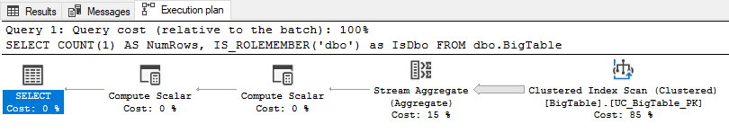
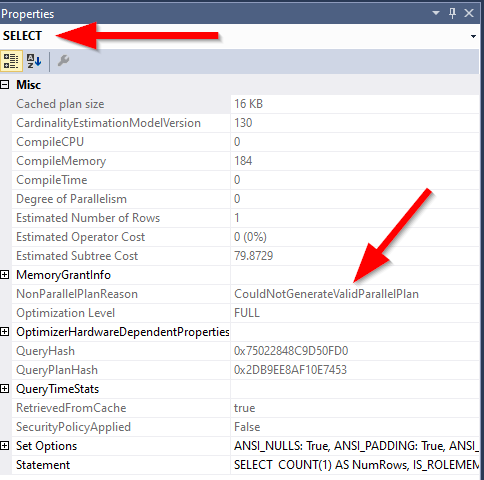
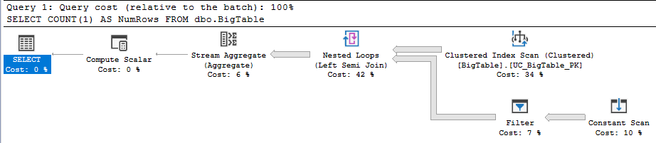

This blog post was inspired by a Reddit post. Redditor `ArchSerpo` posted a question asking about [row-level security performance when predicate checks server or database roles](https://www.reddit.com/r/SQLServer/comments/18180lm/row_level_security_performance_when_predicate/), and Redditor `Prequalified` responded with a suggestion that we'll work through below.

I work with multi-tenant databases in my day job.

Multi-tenant databases using the shared-database shared-schema strategy (i.e., data belonging to multiple tenants is resident within a single table) happen to be one of the key beneficiaries of row-level security.

The other key beneficiary would be applications requiring stringent user access control within any given tenancy. Think medical records that are held in confidence by a General Practice employing multiple General Practitioners, for example, where your General Practitioner should be able to see your medical history but other doctors working within the same building should not.

I suspect row-level security is still a relatively underused security control within SQL Server databases, and part of that is very likely because of query performance issues such as the one that led to this Reddit question.

So let's take a look.

## SQL Server version

I'm working with SQL Server 2016 Developer Edition.

```sql
SELECT @@VERSION;
```

```text
Microsoft SQL Server 2016 (SP2-GDR) (KB4583460) - 13.0.5108.50 (X64)
May 20 2022 20:28:29
Copyright (c) Microsoft Corporation  Developer Edition (64-bit) on
Windows 10 Pro 10.0 <X64> (Build 19045: )
```

## Large table setup

Let's start with a sufficiently large table. We'll put 20 million rows in there to really encourage SQL Server to go parallel. To emulate a table with multi-tenant composition, we'll establish a tenant ID as follows:
- Generate a random `UNIQUEIDENTIFIER` using `NEWID()`
- Convert it to `BINARY(8)`
- Convert it once more to an `INT`
- Take the absolute value using the `ABS` function
- Take the modulo - we'll work with `32767` as that's the maximum positive value that is supported by the `SMALLINT` data type
- Convert it to a non-null value - in a manner that ensures SQL Server understands it's a non-null value - using the `ISNULL` function.

```sql
DROP TABLE IF EXISTS dbo.BigTable;
GO

WITH
        lv0 AS (SELECT 0 g UNION ALL SELECT 0),
        lv1 AS (SELECT 0 g FROM lv0 a CROSS JOIN lv0 b),
        lv2 AS (SELECT 0 g FROM lv1 a CROSS JOIN lv1 b),
        lv3 AS (SELECT 0 g FROM lv2 a CROSS JOIN lv2 b),
        lv4 AS (SELECT 0 g FROM lv3 a CROSS JOIN lv3 b),
        lv5 AS (SELECT 0 g FROM lv4 a CROSS JOIN lv4 b),
        Number (Number) AS (SELECT ROW_NUMBER() OVER (ORDER BY (SELECT NULL)) FROM lv5)
SELECT
        ISNULL(ABS(CONVERT(INT, CONVERT(BINARY(8), NEWID()))) % 32767, 0) AS TenantId,
        ISNULL(Number, 0) AS Number
INTO    dbo.BigTable
FROM    Number
WHERE   Number <= 20000000;

GO

ALTER TABLE dbo.BigTable
ADD CONSTRAINT UC_BigTable_PK
PRIMARY KEY CLUSTERED (TenantId, Number);
```

The successful creation of that primary key constraint `UC_BigTable_PK` on `dbo.BigTable` implies that `TenantId` was in fact a non-null value. But we can also examine the table's structure to confirm this:

```sql
EXEC sp_help 'dbo.BigTable';
```

```text
Column_name Type   Computed Length Prec Scale Nullable
----------- ------ -------- ------ ---- ----- --------
TenantId    int    no       4      10   0     no
Number      bigint no       8      19   0     no
```

## Parallelism

Let's ensure we can in fact see evidence of parallel processing within the query plan.

We'll run a simple `COUNT(1)` query to do that, like so:

```sql
SET SHOWPLAN_TEXT ON;
GO

SELECT  COUNT(1) AS NumRows
FROM    dbo.BigTable;
```

And we can see this query plan which features parallel operators:

```text
|--Compute Scalar(DEFINE:([Expr1002]=CONVERT_IMPLICIT(int,[globalagg1004],0)))
  |--Stream Aggregate(DEFINE:([globalagg1004]=SUM([partialagg1003])))
    |--Parallelism(Gather Streams)
      |--Stream Aggregate(DEFINE:([partialagg1003]=Count(*)))
        |--Clustered Index Scan(OBJECT:([Dan].[dbo].[BigTable].[UC_BigTable_PK]))
```

So far so good.

Now we'll quickly prove that checking server-level and database-level permissions does in fact undermine the query planner's ability to produce a parallel query plan.

When checking for membership in a server role, we see a non-parallel query plan:

```sql
SET SHOWPLAN_TEXT ON;
GO

SELECT  COUNT(1) AS NumRows,
        IS_SRVROLEMEMBER('sysadmin') as IsSysAdmin
FROM    dbo.BigTable;
```

```text
|--Compute Scalar(DEFINE:([Expr1003]=is_srvrolemember(N'sysadmin')))
  |--Compute Scalar(DEFINE:([Expr1002]=CONVERT_IMPLICIT(int,[Expr1006],0)))
    |--Stream Aggregate(DEFINE:([Expr1006]=Count(*)))
      |--Clustered Index Scan(OBJECT:([Dan].[dbo].[BigTable].[UC_BigTable_PK]))
```

When checking for membership in a database role, we also see a non-parallel query plan:

```sql
SET SHOWPLAN_TEXT ON;
GO

SELECT  COUNT(1) AS NumRows,
        IS_ROLEMEMBER('dbo') as IsDbo
FROM    dbo.BigTable;
```

```text
|--Compute Scalar(DEFINE:([Expr1003]=is_rolemember(N'dbo')))
  |--Compute Scalar(DEFINE:([Expr1002]=CONVERT_IMPLICIT(int,[Expr1006],0)))
    |--Stream Aggregate(DEFINE:([Expr1006]=Count(*)))
      |--Clustered Index Scan(OBJECT:([Dan].[dbo].[BigTable].[UC_BigTable_PK]))
```

Visually that latter query plan looks like this:



But the most straightforward indication is when we dig into the `SELECT` operator in the query plan using the `Properties` window within SQL Server Management Studio (SSMS) to observe the `NonParallelPlanReason` value, which is `CouldNotGenerateValidParallelPlan`:



Erik Darling covers this quite well in his blog post [Starting SQL: Why Your SQL Server Query Can't Go Parallel, Scalar Functions Edition](https://erikdarling.com/starting-sql-why-your-query-cant-go-parallel-scalar-functions-edition/).

## Non-parallel row-level security predicate

The scalar function produces the same outcome when running within the context of a row-level security predicate function.

If we create a security predicate function that uses a scalar function within, we'll get the same `NonParallelPlanReason`.

Firstly we'll create our predicate function and policy:

```sql
SET SHOWPLAN_TEXT OFF;
GO
DROP SECURITY POLICY IF EXISTS dbo.SecurityPolicy;
GO
DROP FUNCTION IF EXISTS dbo.SecurityPredicate_fn;
GO

CREATE OR ALTER FUNCTION dbo.SecurityPredicate_fn(
    @TenantId INT
)
RETURNS TABLE
WITH SCHEMABINDING
AS
RETURN
    SELECT  1 AS Result
    WHERE   IS_ROLEMEMBER('dbo') = 1;

GO

CREATE SECURITY POLICY dbo.SecurityPolicy
ADD FILTER PREDICATE dbo.SecurityPredicate_fn(TenantId)
    ON dbo.BigTable
WITH (STATE = ON, SCHEMABINDING = ON);
GO
```

And then we'll re-run our `COUNT(1)` query as we did earlier.

```sql
SET SHOWPLAN_TEXT ON;
GO

SELECT  COUNT(1) AS NumRows
FROM    dbo.BigTable;
```

When we observe the updated query plan we now see.
- One new element: A `Filter` operation.
- A lack of `Parallelism`-featuring query plan operators.
- A `NonParallelPlanReason` with the value `CouldNotGenerateValidParallelPlan`

```text
|--Compute Scalar(DEFINE:([Expr1003]=CONVERT_IMPLICIT(int,[Expr1006],0)))
  |--Stream Aggregate(DEFINE:([Expr1006]=Count(*)))
    |--Nested Loops(Left Semi Join)
      |--Clustered Index Scan(OBJECT:([Dan].[dbo].[BigTable].[UC_BigTable_PK]))
      |--Filter(WHERE:(STARTUP EXPR(is_rolemember(N'dbo')=(1))))
        |--Constant Scan
```




## Putting parallelism back on the table

Which brings us back to the idea in the Reddit post.

The solution proffered was a simple one: Derive the information of interest about the session (e.g.: the database-role and server-role membership of the login used to establish the session), store it in a table, and use that for the security predicate.

The poster suggested a temporary table, but I'm going to deviate a little here.

We'll confirm that `@@SPID` returns a `SMALLINT` value, and then create the table so that it contains one row per conceivable `SPID`.

```sql
SET SHOWPLAN_TEXT OFF;
GO
SET STATISTICS XML, PROFILE OFF;
GO

SELECT
        name,
        is_nullable,
        system_type_name,
        max_length
FROM
        sys.dm_exec_describe_first_result_set(
            'SELECT @@SPID AS spid',
            NULL,
            NULL
        );
```

```text
name is_nullable system_type_name max_length
---- ----------- ---------------- ----------
spid 0           smallint         2
```

Next, we'll create a `dbo.SessionDetail` table and fill it with one row per conceivable session ID.

```sql
SET SHOWPLAN_TEXT OFF;
GO
DROP SECURITY POLICY IF EXISTS dbo.SecurityPolicy;
GO
DROP FUNCTION IF EXISTS SecurityPredicate_fn;
GO
DROP TABLE IF EXISTS dbo.SessionDetail;
GO

WITH
        lv0 AS (SELECT 0 g UNION ALL SELECT 0),
        lv1 AS (SELECT 0 g FROM lv0 a CROSS JOIN lv0 b),
        lv2 AS (SELECT 0 g FROM lv1 a CROSS JOIN lv1 b),
        lv3 AS (SELECT 0 g FROM lv2 a CROSS JOIN lv2 b),
        lv4 AS (SELECT 0 g FROM lv3 a CROSS JOIN lv3 b),
        lv5 AS (SELECT 0 g FROM lv4 a CROSS JOIN lv4 b),
        Number (Number) AS (SELECT ROW_NUMBER() OVER (ORDER BY (SELECT NULL)) FROM lv5)
SELECT
        ISNULL(CONVERT(SMALLINT, Number), 0) AS SessionNumber,
        ISNULL(CONVERT(BIT, 0), 0) AS CanReadAnyRow,
        ISNULL(CONVERT(INT, @@SPID), 0) AS TenantId
INTO    dbo.SessionDetail
FROM    Number
WHERE   Number <= 32767;

GO

ALTER TABLE dbo.SessionDetail
ADD CONSTRAINT UC_SessionDetail_PK
PRIMARY KEY CLUSTERED (SessionNumber);
GO
```

We'll revise our security predicate:

```sql
SET SHOWPLAN_TEXT OFF;
GO
DROP SECURITY POLICY IF EXISTS dbo.SecurityPolicy;
GO
DROP FUNCTION IF EXISTS SecurityPredicate_fn;
GO

CREATE OR ALTER FUNCTION SecurityPredicate_fn(
    @TenantId INT
)
RETURNS TABLE
WITH SCHEMABINDING
AS
RETURN
    SELECT  1 AS Result
    FROM    dbo.SessionDetail
    WHERE
            SessionNumber = @@SPID AND
            (
                CanReadAnyRow = 1 OR
                TenantId = @TenantId
            );

GO

CREATE SECURITY POLICY dbo.SecurityPolicy
ADD FILTER PREDICATE dbo.SecurityPredicate_fn(TenantId)
    ON dbo.BigTable
WITH (STATE = ON, SCHEMABINDING = ON);
GO
```

We can set session information in the `dbo.SessionDetail` table for a given session like so:

```sql
SET SHOWPLAN_TEXT OFF;
GO

UPDATE  dbo.SessionDetail
SET
        TenantId = @@SPID,
        CanReadAnyRow =
            ISNULL(
                CONVERT(BIT, IS_ROLEMEMBER('db_datareader')),
                ISNULL(
                    CONVERT(BIT, IS_ROLEMEMBER('dbo')),
                    IS_SRVROLEMEMBER('sysadmin')
                )
            )
WHERE
        SessionNumber = @@SPID;
```

And re-run our `COUNT(1)` query to observe a parallel query plan:

```sql
SET SHOWPLAN_TEXT OFF;
GO

SELECT  COUNT(1) AS NumRows
FROM    dbo.BigTable;
```

```text
|--Compute Scalar(DEFINE:([Expr1005]=CONVERT_IMPLICIT(int,[globalagg1008],0)))
  |--Stream Aggregate(DEFINE:([globalagg1008]=SUM([partialagg1007])))
    |--Parallelism(Gather Streams)
      |--Stream Aggregate(DEFINE:([partialagg1007]=Count(*)))
        |--Nested Loops(Left Semi Join, WHERE:([Dan].[dbo].[SessionDetail].[IsSysAdmin]=(1) OR [Dan].[dbo].[SessionDetail].[IsDbo]=(1) OR [Dan].[dbo].[SessionDetail].[IsDbDataReader]=(1) OR [Dan].[dbo].[SessionDetail].[TenantId]=[Expr1006]))
          |--Compute Scalar(DEFINE:([Expr1006]=CONVERT_IMPLICIT(int,[Dan].[dbo].[BigTable].[TenantId],0)))
          |    |--Clustered Index Scan(OBJECT:([Dan].[dbo].[BigTable].[UC_BigTable_PK]))
          |--Table Spool
            |--Clustered Index Scan(OBJECT:([Dan].[dbo].[SessionDetail].[UC_SessionDetail_PK]))
```

At this point we once again have parallelism featuring in our query plan.


## Gotchas

One challenge with this approach - using a normal table such as `dbo.SessionDetail` instead of a temporary table - is that it's difficult to enforce the updating of the row within the table to reflect the details of the current session for a given `@@SPID`.

If a `SPID` was used previously by a `sysadmin`, for example, and then re-used later by a non-sysadmin who did not update the `dbo.SessionDetail` row then that subsequent session would be able to read all rows from `dbo.BigTable`.

In a way, using the temporary table might actually be a good control when it comes to mitigating this risk. After all, if the temporary table isn't created then it won't exist when the security predicate runs. This would mean a hard-failure when SQL Server attempts to run the query due to an object (the temporary table) not existing.

In other words, we would fail closed instead of silently failing open.

You could conceivably employ a logon trigger, but that might not be ideal if your SQL Server instance is hosting numerous databases. But it is an option that could be made to work, and it would guarantee the necessary update to `dbo.SessionDetail` that is required.

If you're operating in a database environment that doesn't deal in ad-hoc SQL queries, because everything lives within Stored Procedures, then it gets a fair bit easier. You simply ensure that the `dbo.SessionDetail` row update occurs as part of the stored procedure's preamble code (alongside things like checking for invariants).
