# MatchScore Screenshots

## Application Screenshots

### Competitor screens

  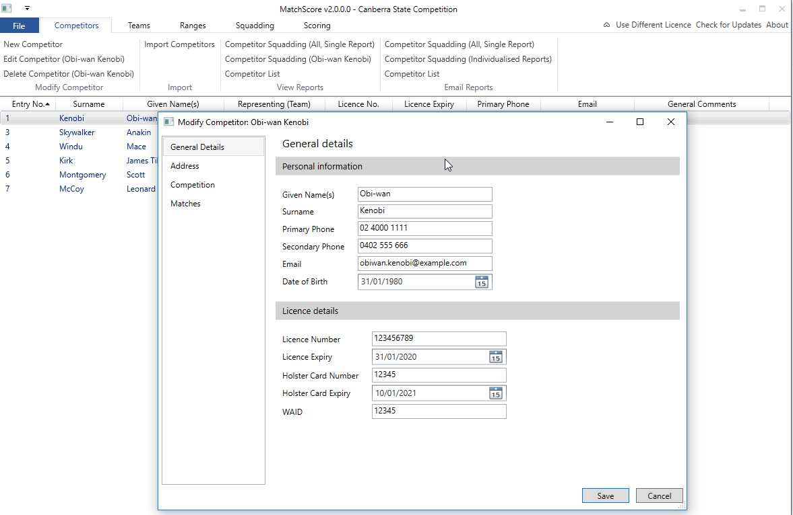

### Team screens

  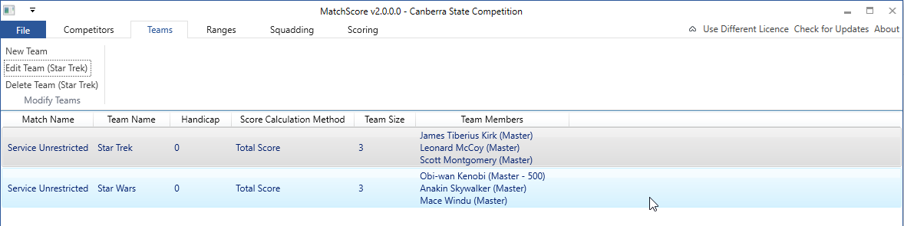

  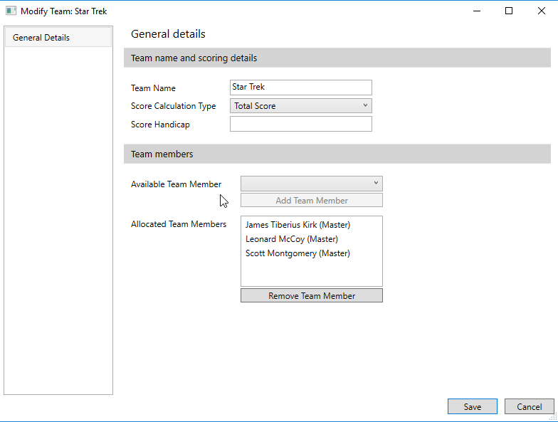

### Scheduling screens

  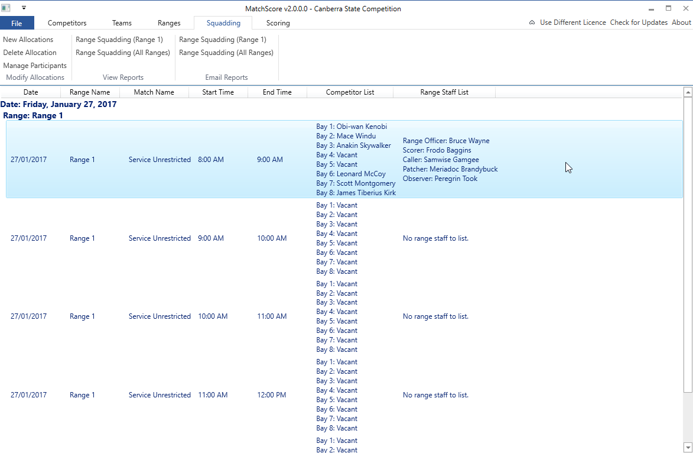

  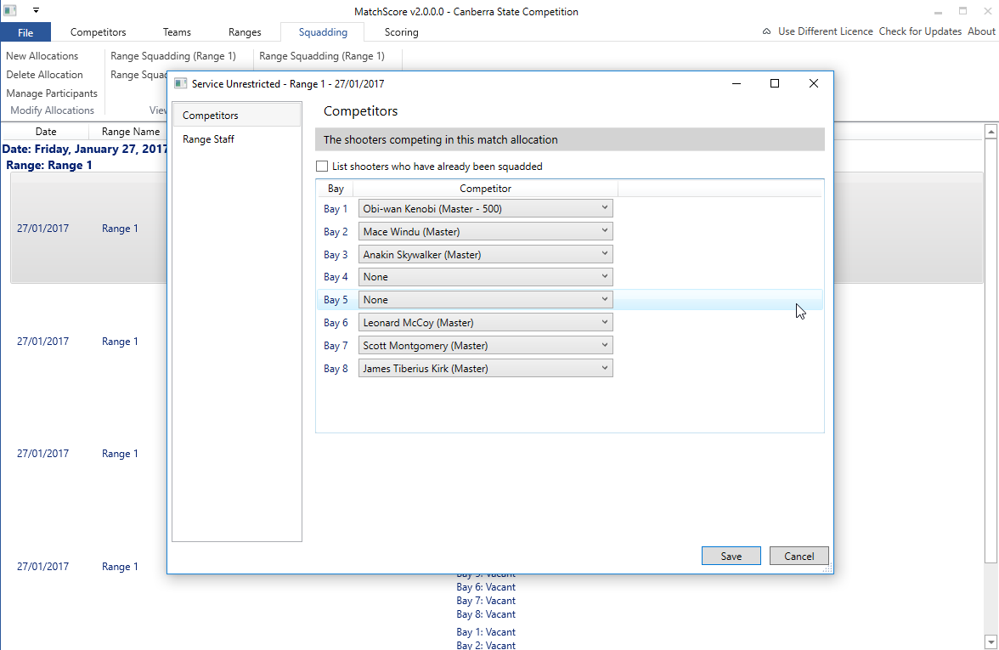

  

### Scoring screens

  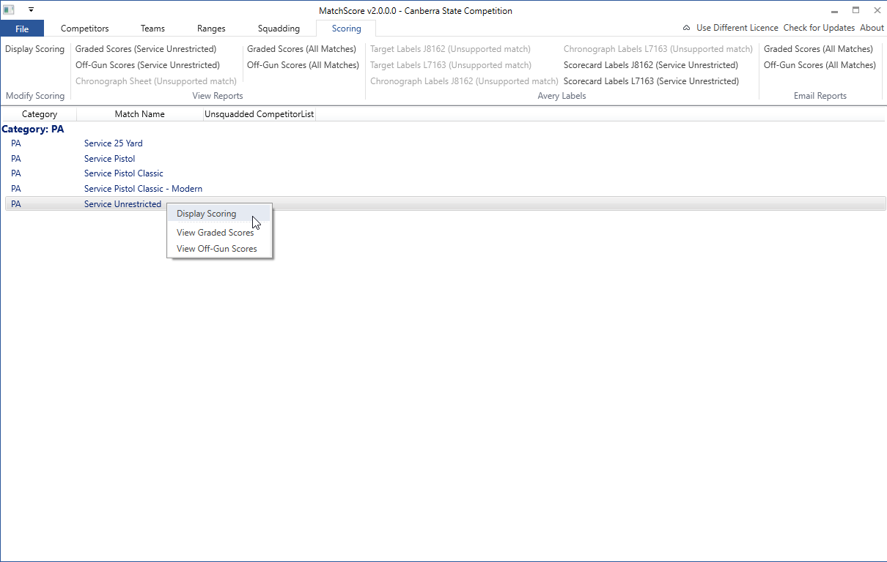

  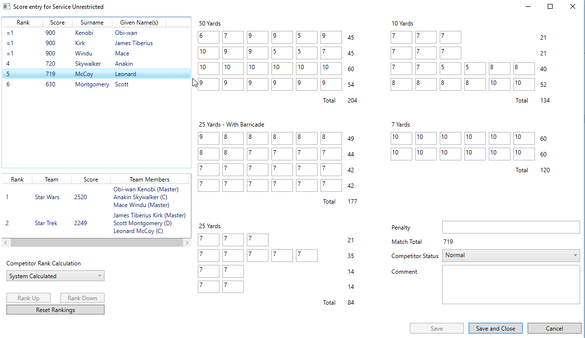

### Miscellaneous screens

  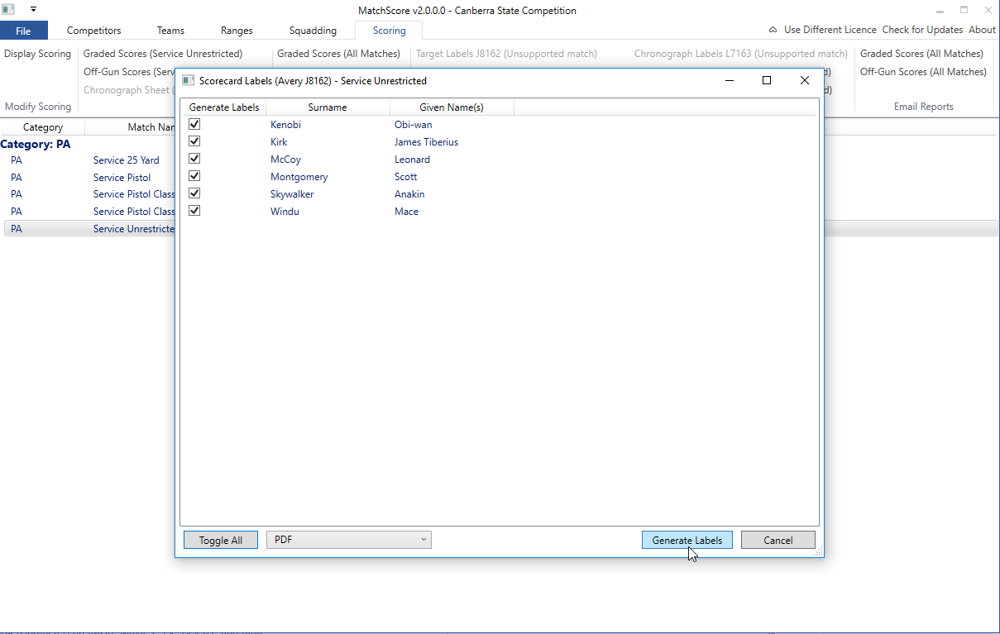

## Report Screenshots

  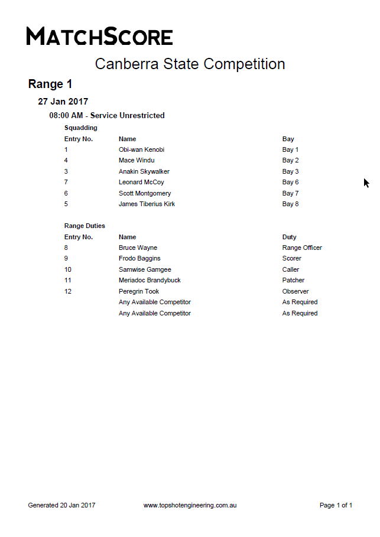

  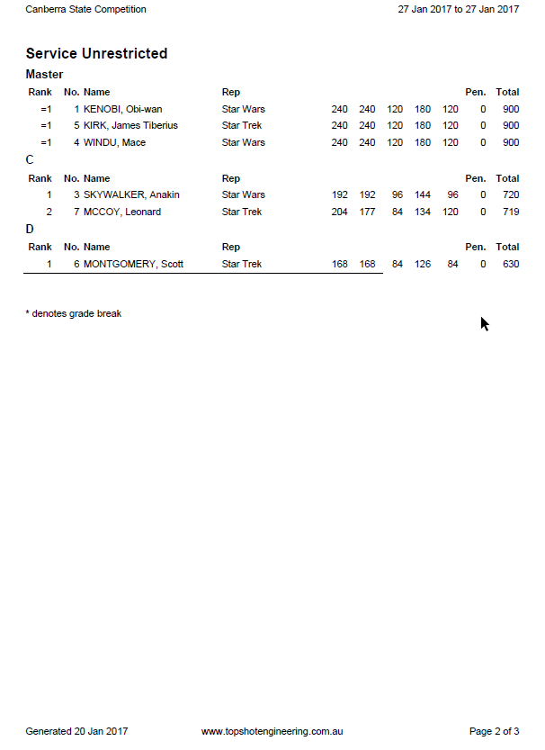

  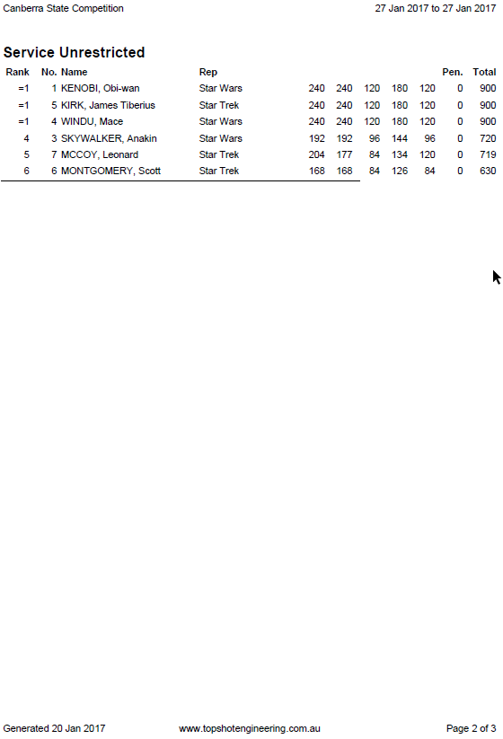

  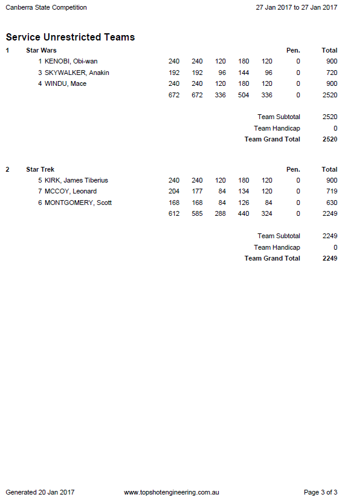

